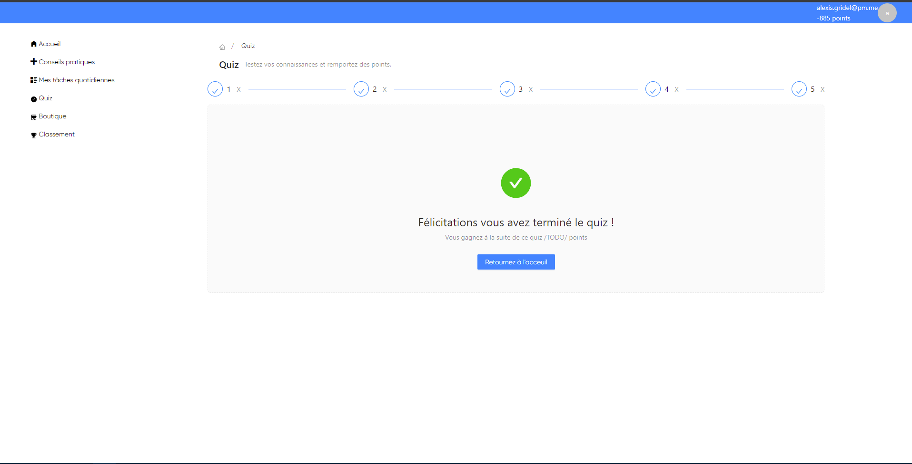

<h1 align="center">
   
  
   
  PlanetSalvator
   
</h1>

<h4 align="center">A blazor WASM Asp.CORE hosted PWA application</h4>
<h5 align="center">Modulable, open-source, powerful, educational and playful.</h5>

  <a href="#overview">Overview</a>
  •
  <a href="#installation">Installation</a>

                         

# Overview
PlanetSalvator is a project built to make people be aware of climate changes issues, and to educate the youth. The project has been built as participation of the **Bourse Coddity** for 2022 . It is powered with Blazor.NET and Web Assembly, the API server side is hosted with ASP.NET Core with Mediator pattern. The web application supports PWA (Progressive Web Application), PlanetSalvator is blazing fast as a native application, cool right ?
The project supports a lot of activites to make people be aware of climate changes issues, there are questions in shape of Quizz, daily tasks, etc. Been in the mind of gamification, a point counter feature has been built with a leadertop page to make people more intersted within the project idea.

# Installation              
(You need to have .NET 6 in your machine to build/runs the project)                 
To self-host PlanetSalvator in your machine you have to :        
`$ dotnet tool install --global dotnet-ef` // Install Entity Framework Core tool for dotnet cli        
`$ git clone https://github.com/Inerska/PlanetSalvator`                  
`$ cd PlanetSalvator`                
`$ cd src`             
`$ cd PlanetSalvator.Web`              
`$ cd Server`                
`$ dotnet ef database update`    // Generate the tables for the generated Sqlite database                 
`$ dotnet run`           

Go to your browser at `https://localhost:7290` by default, (watch the console outputs).

# Run the HTML API generated documentation 
To run the html api generated documention you need to have DocFx in your machine, to install it please take a look at its documentation.
Move to the root project path and then type :

`$ docfx init -q`                 
`$ docfx docfx_project\docfx.json --serve`             

and then go to your browser at `localhost:8080` to see the API documentation of the full project.
